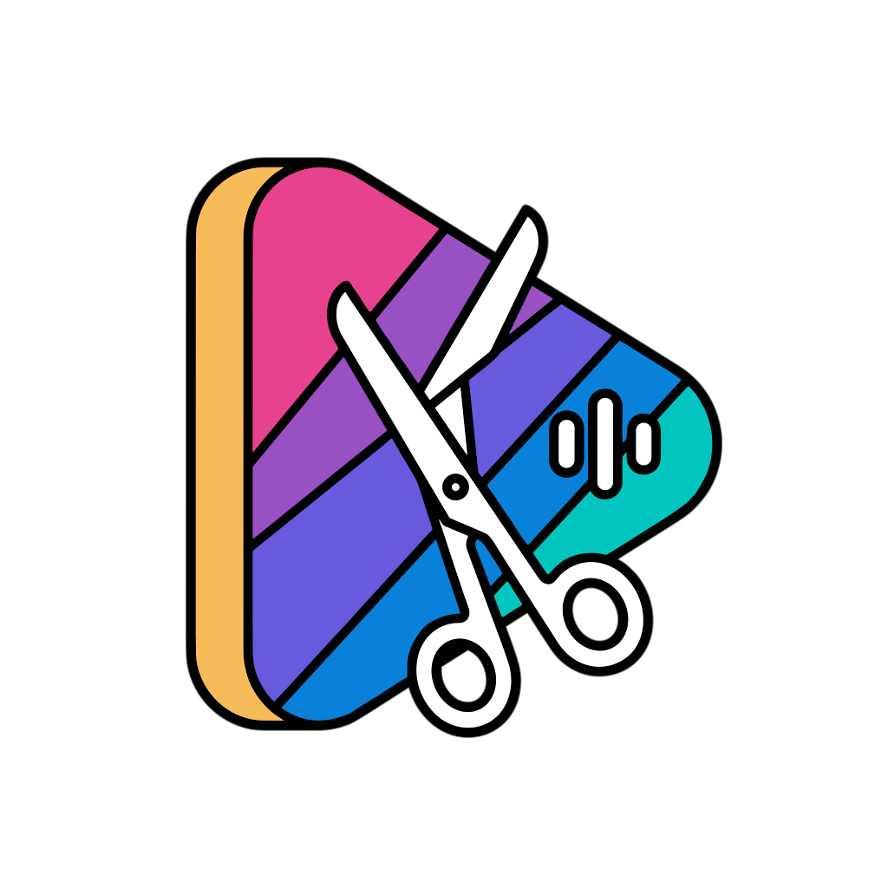
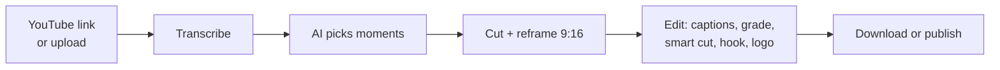

<div align="center">
  

  <h1>ClippyMe</h1>

  <p><b>Turn long videos into vertical shorts, on your own machine.</b></p>

  <p>
    <a href="https://github.com/fralapo/clippyme/actions/workflows/ci.yml"></a>
    
    
  </p>
</div>

ClippyMe is a self-hosted web app for creators and editors. Give it a YouTube
link or a video file; it finds the moments worth sharing, cuts them into 9:16
clips with captions, and lets you polish and publish them to TikTok,
Instagram and YouTube. It can also watch Kick, Twitch and YouTube channels and
do all of that automatically.

## What it does

- **Finds the best moments.** The video is transcribed, and Google Gemini
  picks and ranks self-contained clips, with a title, hook and captions for
  each. Clip edges land on sentence boundaries and silences, never mid-word.
- **Frames them for vertical.** Active-speaker tracking keeps the person
  talking in frame, with a camera that stays still within each shot. You can
  switch a clip to subject-centred framing or to a letterboxed full frame at
  any time.
- **Lets you edit before you post.** Colour grade, six animated caption
  styles, silence and filler-word removal, manual transcript trimming (or
  "cut the intro" in plain language), hook text, logo and attribution banner —
  applied when you download or publish, previewed first.
- **Publishes and schedules** through [Zernio](https://zernio.com), picking
  prime-time slots and spacing posts to respect platform limits.
- **Runs unattended.** The live monitor follows streams and uploads,
  clips each segment, and publishes the best clips on its own.
- **Stays under your control.** Everything runs on your hardware; clips,
  settings and keys stay in local folders. Long jobs survive restarts and
  resume where they stopped.

## How it works



Transcription uses Deepgram (the default) or ElevenLabs when you add its key
and select it in Settings, and local Whisper otherwise. Without a Gemini key, ClippyMe still splits the video by
topic, but clips are not ranked. The [architecture
overview](docs/architecture/overview.md) explains the design.

## Quick start

You need Docker with Compose v2. Then:

```bash
git clone https://github.com/fralapo/clippyme.git
cd clippyme
docker compose up --build
```

Open <http://localhost:5175>, go to **Settings**, and add the API keys you
have:

| Key | Needed for |
|-----|-----------|
| Gemini | Choosing and ranking moments, titles (recommended) |
| Deepgram or ElevenLabs | Fast cloud transcription (optional; local Whisper otherwise) |
| Zernio | Publishing and scheduling (optional) |
| Twitch app credentials | Monitoring Twitch channels (optional) |

Then paste a video link in **Create**. The [getting started
guide](docs/getting-started.md) walks through the first job, updating, and
where files are stored.

An NVIDIA GPU is optional
(`docker compose -f docker-compose.yml -f docker-compose.gpu.yml up --build`);
see [deployment](docs/deployment.md) for this and the production frontend.

## Security

By default ClippyMe listens only on `127.0.0.1` and trusts every client on the
local network for its settings. Before opening it to other devices on a
trusted network, set an API token; exposing it to the internet is not
supported. Details:
[deployment → network exposure](docs/deployment.md#network-exposure).
To report a vulnerability, see [SECURITY.md](SECURITY.md).

## Documentation

- [Getting started](docs/getting-started.md) · [Deployment](docs/deployment.md)
- [Architecture](docs/architecture/overview.md)
- [Configuration reference](docs/reference/configuration.md) · [HTTP API](docs/reference/api.md)
- [All documentation](docs/README.md)

## Contributing

Contributions are welcome. [CONTRIBUTING.md](CONTRIBUTING.md) covers setup,
the checks CI runs, and the project's rules. The stack is Python 3.11 with
FastAPI for the backend, a subprocess pipeline built on ffmpeg, OpenCV,
MediaPipe and YOLOv8, and React 18 with Vite and Tailwind for the dashboard.

## Acknowledgements

ClippyMe started as a fork of
[OpenShorts](https://github.com/SamurAIGPT/Open-Source-Shorts-Maker).
It builds on [yt-dlp](https://github.com/yt-dlp/yt-dlp),
[Faster-Whisper](https://github.com/SYSTRAN/faster-whisper),
[PySceneDetect](https://github.com/Breakthrough/PySceneDetect),
[Ultralytics YOLO](https://github.com/ultralytics/ultralytics),
[MediaPipe](https://github.com/google/mediapipe),
[auto-editor](https://github.com/WyattBlue/auto-editor),
[FFmpeg](https://ffmpeg.org), [FastAPI](https://fastapi.tiangolo.com) and
[React](https://react.dev), and on the services
[Google Gemini](https://ai.google.dev), [Deepgram](https://deepgram.com),
[ElevenLabs](https://elevenlabs.io) and [Zernio](https://zernio.com).
Ideas ported from other open-source projects —
[ClipsAI](https://github.com/ClipsAI/clipsai) (topic segmentation),
[FrameShift](https://github.com/fralapo/FrameShift) (subject framing),
[VideoLingo](https://github.com/Huanshere/VideoLingo) (subtitle line
splitting) and several reframing projects — are credited in
[docs/research](docs/research/README.md).

## License

[MIT](LICENSE)
