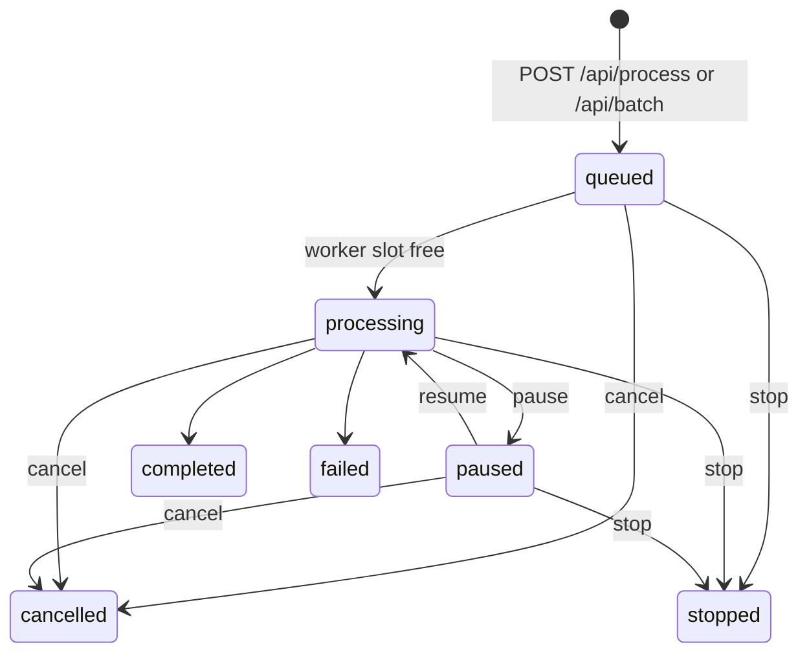

# Jobs and runtime

A job turns one source video into clips. This page covers how a job is queued,
run, retried, recovered after a restart, and verified. What the pipeline does
inside a job is in [pipeline.md](pipeline.md).

## Lifecycle

1. `POST /api/process` (one URL or upload) or `/api/batch` (up to 20 URLs)
   builds the orchestrator command (`job_results.build_main_cmd`) and calls
   `job_submission.submit_job`, which records the job in memory, journals it
   and puts it on an `asyncio.Queue`. A full queue rolls the submission back.
2. `job_worker.process_queue` dispatches jobs under a semaphore of
   `MAX_CONCURRENT_JOBS`.
3. `job_runner.run_job` starts `python -m clippyme.pipeline.orchestrator` as a
   subprocess and polls partial results every 2 s, so finished clips appear in
   the dashboard while later ones render.
4. The status machine lives in `job_control.py`. `stopped` keeps the clips
   finished so far; `cancelled` deletes the job directory. Pause and resume
   suspend and resume the whole process tree (psutil).

The dashboard stops polling only on `completed`, `stopped`, `cancelled` or
`failed`. Any other status polls forever, which is why recovery reuses
`failed` rather than inventing new terminal states.

## Orchestrator

Queued jobs run `clippyme.pipeline.orchestrator`, not `pipeline.main`
directly. `main.py` still owns transcription, AI analysis, cutting and reframe;
the orchestrator wraps those stages with:

- **Preflight** (`pipeline/preflight.py`) before any paid work: probes duration
  and size, estimates runtime, peak disk, clip count and Gemini tokens/cost,
  and rejects the job when it would exceed a configured limit. The cost
  estimate is an upper bound over the model fallback and reformat-retry
  chains, including thinking tokens; an unpriced reachable model fails closed
  while a cost limit is set.
- **Durable state**: `<job>/.clippyme_runtime.json` (phase, progress, attempt,
  timings, preflight and QA summaries) and `<job>/.clippyme_checkpoint/`
  (transcript, clip plan, source trim). Writes are atomic, fsync'd and
  owner-only; the `/videos` mount refuses to serve them.
- **Checkpoint reuse**: a retry or a resumed job reuses a valid download,
  transcript, clip plan, source slices and finished clips instead of paying
  for them again. A torn checkpoint is ignored, not trusted. Progressive
  metadata alone is never treated as proof of completion.
- **Output QA** (`pipeline/media_qa.py`): every temporary render is probed
  before it atomically replaces the public clip — size, duration, audio and
  video streams, aspect ratio, black and frozen-frame ratios, loudness.
  Structural defects are critical and trigger a bounded re-render
  (`CLIPPYME_RENDER_QA_RETRIES`); signal findings become warnings in the clip
  metadata and the clip is kept.
- **Bounded ffmpeg** (`pipeline/ffmpeg_exec.py`): stderr goes to a temporary
  file, a no-progress watchdog enforces `CLIPPYME_FFMPEG_TIMEOUT`, and output
  is written as `.partial-*` then validated and renamed, so an interrupted cut
  never appears under its final name.

`source_<clip>.mp4` slices are kept after success on purpose: post-hoc reframe
needs them.

## Exit codes and retries

| Exit code | Meaning | Retried? |
|-----------|---------|----------|
| `0` | Success | — |
| `2` | Deterministic rejection (invalid input, preflight limit) | Never |
| other / signal | Transient failure | Yes, up to `CLIPPYME_JOB_MAX_ATTEMPTS` (default 3, bounded 1–10) |

Backoff between attempts is exponential and capped (1, 2, 4, 8, 16, 30, 30 …
seconds). Cancelling during a backoff wait ends the job.

## Restart recovery

`data/jobs_journal.json` is rewritten on every status transition and holds
**active jobs only** — never secrets, `Popen` handles or logs. On startup the
`lifespan` handler:

1. re-enqueues jobs that were still `queued`;
2. restores interrupted jobs whose final result reached disk;
3. re-enqueues interrupted jobs that can resume — runtime state and original
   source still safe to reuse — so they continue from their checkpoints;
4. marks the rest `failed`.

Orphaned pipeline process trees from the previous run are killed
(psutil, guarded by an argv match so an unrelated process is never killed). The live monitor adds its own
ownership recovery on top of this; see [live-monitor.md](live-monitor.md).

## Telemetry

`GET /api/status/{job_id}` may include `result.operations`: phase, attempt,
ETA, verified and failed clip counts, host CPU, process-tree RAM, free disk,
preflight estimates, per-stage durations and QA summaries. The dashboard shows
these in the processing view. The job log keeps one replaceable `[runtime]`
line, so polling cannot grow it without bound (`MAX_LOG_LINES` caps the rest).

## Retention

`JOB_RETENTION_SECONDS` purges `output/` and `uploads/` entries older than the
limit (the backend default is 30 days; the shipped `docker-compose.yml` sets
`0`, which disables purging so the History tab's Delete stays the only way
jobs disappear). Jobs in an active state are never purged.

Settings for everything on this page: [configuration reference](../reference/configuration.md#jobs-and-runtime).
