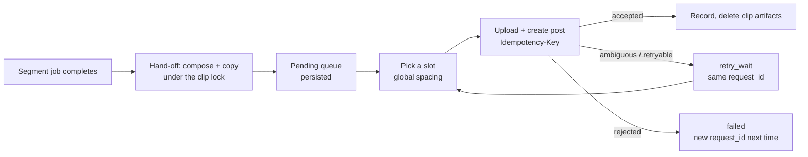

# Live monitor

The live monitor watches creator channels and turns their content into
published shorts without manual steps. It runs inside the backend process
(`monitoring/live_monitor.py`: `LiveMonitorRegistry` plus one strategy per
platform) and submits ordinary jobs through the same queue as the dashboard.

## What it watches

| Platform | `live` mode | `vod` mode |
|----------|-------------|------------|
| Kick | Captures the running stream in segments (default 30 min) and processes each segment as a job | Processes each new VOD |
| Twitch | Same as Kick (Helix app credentials required) | Processes each new VOD |
| YouTube | — | New long-form uploads from the channel's RSS feed (Shorts are excluded by the feed choice), from activation onward |

Several monitors run at once, one per platform + channel. State survives
restarts in `data/live_monitor.json`; monitors marked `resume_on_start` start
again automatically.

## Per-monitor behaviour

- **Prelive skip** (`prelive_skip_seconds`, default 30 min): the waiting screen
  at the start of a stream is skipped, measured from the stream's own start
  time. On Kick and Twitch it also applies to VODs; never to YouTube uploads.
- **Catch-up** (`catchup`, live mode only, chosen at start): `backfill`
  recovers stream time that passed before capture began — on Twitch by range
  download from the in-progress archive VOD (matched by `stream_id`), on Kick
  from the replay once the stream ends, since Kick publishes no VOD while live.
  `live_only` starts coverage at launch.
- **Clip selection**: `fixed` publishes the top `max_clips` (default 5) of a
  segment by viral score; `auto` first drops clips under `min_viral_score`
  (default 70), so a weak segment yields fewer clips or none. `max_clips: 0`
  means no cap. Monitor jobs never fall back to TextTiling or a whole-video
  render.
- **Look**: monitor clips always render with reframe `disabled` (letterbox,
  optional `letterbox_zoom`), a full-clip hook, the attribution banner attached
  under the video band, and subtitles; `smart_cut` is opt-in. All overridable
  per monitor.
- **Runtime config**: `POST /api/live-monitor/{id}/config` changes an
  allow-listed set of fields (templates, instructions, spacing, segment
  length, platforms, look); changes apply to future clips. Platform, mode and
  channel need a new monitor.

## Publishing flow

- Posts from **all** monitors share one spacing rule (`min_gap_seconds`,
  default 15 min) enforced through the global `picked_slots` list under the
  monitor publish lock. There is no daily cap.
- Title and caption templates accept `{title}` and `{hook}`; optional AI
  instructions steer clip selection.
- Publishing can be paused and resumed per monitor
  (`POST /api/live-monitor/{id}/publishing`). Pending clips are persisted and
  drain on resume or after a restart.
- A publication has a stable `publication_id` and a `request_id` used as the
  Zernio `Idempotency-Key`. Retries back off from 60 s to 1 h, at most 8
  attempts. Identity and idempotency rules are in
  [publishing.md](publishing.md#publish-identities).
- After a confirmed publish the clip's files are deleted (default
  `delete_after_publish: true`) and its metadata entry is marked
  `deleted_after_publish`. Positions in `shorts` stay stable, so consumers
  address clips by `original_index`.
- While the monitor owns a clip (job not yet handed off, or publication
  queued / in flight / waiting to retry) a manual publish of that clip answers
  409. A failed publication releases it.

## Failure handling

| Situation | Behaviour |
|-----------|-----------|
| Job queue full | Waited out with capped backoff (≤ 120 s), shown in `last_error` |
| Provider or network error checking live state, or resolving a YouTube channel | Retried with backoff up to 15 min |
| Invalid channel (`ValueError`) or a bug | The monitor stops with the error |
| Restart while a segment job had finished but not been handed off | The finished job is rebuilt from its runtime state and final metadata, and handed off once |
| Restart while a backfill job was running | The backfill window already belongs to that job, so it is re-attached, not cut again |

`picked_slots` and the `published` dedup guard are pruned by retention
windows derived next to `PICKED_SLOT_RETENTION_SECONDS` and
`PUBLISHED_RETENTION_SECONDS`; the failed-publication list is bounded.

Delivery is at least once: a crash between the provider accepting a post and
the monitor recording it can publish that clip twice after the idempotency
window. See [publishing.md](publishing.md).
