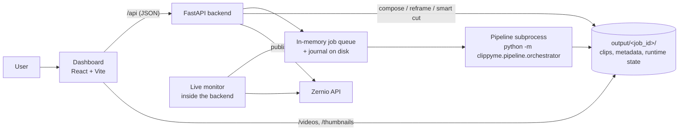

# Architecture overview

ClippyMe is a single-host application: a React dashboard, a FastAPI backend,
and one pipeline subprocess per running job. There is no database; all state is
files on disk.

## Components

| Component | Code | Responsibility |
|-----------|------|----------------|
| Dashboard | `dashboard/src/` | The whole UI, one folder per feature under `features/`. Talks to the backend only through `/api` and the static media mounts. |
| API layer | `src/clippyme/api/` | HTTP routes, request validation (Pydantic), security gates, static mounts, startup/shutdown. Thin: no business logic. |
| Services | `src/clippyme/jobs/`, `clips/`, `editing/`, `monitoring/`, `publishing/` | Everything an endpoint does, one package per responsibility: the job lifecycle (submission, queue, runner, journal, runtime state, history and restore, uploads); per-clip operations (resolution, locks, smart cut and reframe requests); the compose layers (grade, subtitles, smart cut, hook, logo, banner); the live monitor; manual publishing. Never imports FastAPI. |
| Shared | `src/clippyme/core/`, `src/clippyme/media/` | `core`: error types mapped to HTTP statuses, SSRF-safe DNS resolution, the Gemini clip schema. `media`: ffmpeg/ffprobe primitives shared by the pipeline and the compose layers (encode settings, probing, atomic ffmpeg execution). |
| Pipeline | `src/clippyme/pipeline/` | The per-job subprocess: download, transcription (`transcription/`; local Whisper in `main.py`), AI clip selection (`analysis/`), cutting, reframing (`reframe/`), post-processing, output QA (`quality/`). `orchestrator.py` and `main.py` stay at the package root. |
| Integrations | `src/clippyme/integrations/` | Clients for external services: Zernio, Kick, Twitch, YouTube RSS, the auto-editor updater. |
| Storage | `src/clippyme/storage/` | `data/config.json` (keys and settings entered in the dashboard). |

Subsystem pages:

- [Jobs and runtime](jobs.md) — job lifecycle, queue, journal, retries, resume, output QA.
- [Video pipeline](pipeline.md) — what happens inside a job, and the compose layers applied afterwards.
- [Reframe](reframe.md) — how 16:9 becomes 9:16.
- [Live monitor](live-monitor.md) — watching channels and publishing automatically.
- [Publishing](publishing.md) — Zernio, scheduling, idempotency.

## Boundaries

- **API → services → pipeline.** Handlers validate input, call a service
  function and return JSON. Service code raises `ClippyMeError` subclasses
  (`ValidationError` → 400, `NotFoundError` → 404, `ConflictError` → 409),
  mapped to HTTP by one application-level handler.
- **Backend ↔ pipeline** is a process boundary. The backend starts
  `python -m clippyme.pipeline.orchestrator` with an argv list and an
  environment, then reads its stdout and the files it writes. A crash in the
  heavy CV/ML code cannot take the API down, and a job can be paused, resumed
  or killed as a process tree.
- **Pure vs heavy code.** `pipeline/main.py`, `reframe.py` and
  `reframe_detect.py` import OpenCV, PyTorch and MediaPipe. Decision logic lives
  in modules that do not (`reframe_ops.py`, `reframe_track.py`, `cut_ops.py`,
  `run_ops.py`, `gemini_request.py`, `smartcut_ops.py`, …) so it can be tested
  on any machine. See [testing](../development/testing.md).
- **Frontend ↔ backend.** The dashboard holds editing choices (compose
  toggles, trims) as UI state and sends them with each compose, download or
  publish request. The backend does not store a draft of the edit; it renders
  what the request describes.

## Persistence model

Everything lives under three directories next to the code (mounted into the
container in Docker):

| Path | Contents | Written by |
|------|----------|-----------|
| `data/config.json` | API keys, default model, transcription provider, Zernio and Twitch credentials (mode `0600`) | Settings endpoints |
| `data/cookies.txt`, `data/logo.png`, `data/fonts/` | Uploaded cookies, brand logo, custom fonts | Settings endpoints |
| `data/jobs_journal.json` | Active jobs only, for restart recovery; never secrets or logs | Every job status change |
| `data/live_monitor.json` | Monitor configs, in-flight jobs, pending publications, dedup state | Live monitor |
| `data/cache/` | Transcripts (7 days, keyed by URL hash), banner logos | Pipeline, banner renderer |
| `uploads/` | Local videos uploaded for processing | Upload endpoint |
| `output/<job_id>/` | Rendered clips, `source_*.mp4` slices, `<title>_metadata.json`, `.clippyme_runtime.json`, `.clippyme_checkpoint/` | Pipeline subprocess, then compose/reframe/publish |

Rules that keep this safe without a database:

- Anything a crash could corrupt is written atomically (temporary file, then
  `os.replace`) and owner-only. Runtime state and the job journal also fsync.
- The job metadata file is one shared document. API-side writers go through
  `job_artifacts.update_job_metadata` (reload, change, save under one lock),
  never a copy loaded before a long render.
- Per-clip work (compose, reframe, smart cut, publish) is serialised by
  `clip_locks.clip_lock`. The lock order is documented in
  [CLAUDE.md](../../CLAUDE.md#invariants).
- While a job is queued, processing or paused, the pipeline owns its metadata;
  reframe, publish and history restore answer 409 until it finishes.

## Key design decisions

- **One subprocess per job** rather than in-process workers: isolation from
  native-library crashes, killable process trees, and no GIL contention with
  the API.
- **Files instead of a database**: a self-hosted, single-user tool; artifacts
  are large media files anyway, and the job directory is the unit of backup
  and deletion.
- **At-least-once publishing**: a post that may have gone through is retried
  with the same idempotency key rather than dropped; see
  [publishing](publishing.md).
- **Compose on demand**: edits are rendered when a clip is downloaded or
  published, from the original render plus the requested layers, so edits
  never degrade the stored clip.

## Glossary

| Term | Meaning |
|------|---------|
| Job | One processing run over one source video, identified by a UUID4 `job_id`, stored in `output/<job_id>/`. |
| Clip | One short produced by a job. Identified by `(job_id, clip_index)`; `original_index` is its stable position in the metadata `shorts` list. |
| Source slice | `source_<clip>.mp4`: the 16:9 section a clip was cut from, kept so the reframe mode can change later. |
| Compose | Rendering the enabled edit layers (grade, subtitles, smart cut, hook, logo, banner) onto a clip. |
| Reframe | Converting the landscape source to the output aspect (9:16 by default). Modes: `auto`, `subject`, `disabled`. |
| Smart cut | Removing silences and filler words, plus manual trims (`drop_ranges`). |
| Runtime state | `.clippyme_runtime.json`: a job's durable phase, progress and attempt counter. |
| Checkpoint | `.clippyme_checkpoint/`: reusable artefacts (transcript, clip plan) that let a retry skip paid work. |
| Monitor | A live-monitor instance watching one channel on one platform. |
| Segment | A fixed-length piece of a live stream captured by a monitor and processed as one job. |
| Backfill | Recovering stream time that passed before a monitor started capturing. |
| Publication | One monitor clip's trip to Zernio, with a stable `publication_id`. |
