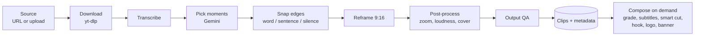

# Video pipeline

What happens inside one job, and the edit layers applied to a clip afterwards.
Job queueing, retries and resume are in [jobs.md](jobs.md).

## Stages

**Download** (`pipeline/download.py`). yt-dlp with a player-client fallback
chain (`YTDLP_PLAYER_CLIENTS`): a 403 or format failure moves to the next
client; a bot wall, private/removed video or geo block stops immediately.
Optional cookies (uploaded in Settings) unlock age-gated or region-locked
videos. Local uploads skip this step. A `--start-offset` trims a pre-roll with
a stream copy (the live monitor uses it to skip a stream's waiting screen).

**Transcribe.** The audio is extracted to mono 16 kHz FLAC first, so only audio
is uploaded or decoded. `TRANSCRIPTION_PROVIDER` selects:

| Provider | Notes |
|----------|-------|
| `deepgram` (default) | Nova-3 REST; `multi` language handles EN/IT code-switching; free diarization |
| `elevenlabs` | Scribe; audio-event tags such as `(laughter)` are passed to the AI prompt as a signal; optional Voice Isolator pre-pass |
| `whisper` | Local Faster-Whisper; model size picked from available hardware |

Both cloud providers fall back to Faster-Whisper on any failure, so a missing
or bad key never fails a job. Transcripts are cached for 7 days under
`data/cache/`, keyed by URL hash.

**Pick moments** (`main.get_viral_clips`, `gemini_request.py`,
`gemini_parser.py`). The transcript, with per-word timing encoded compactly
(TOON), goes to Gemini (`GEMINI_MODEL`, default `gemini-3.5-flash`), which
returns candidate clips scored on a five-axis rubric. On quota or high-demand
errors the job walks `GEMINI_FALLBACK_MODELS`; a malformed response goes
through a five-level JSON repair chain and a bounded reformat retry. How the
prompt writes titles and hooks, and why, is in
[research/title-hook-copy.md](../research/title-hook-copy.md).
If no AI result is available, the transcript is split by lexical TextTiling
into several topic clips (heuristic, not ranked); rendering the whole video is
the last resort. Live-monitor jobs disable both fallbacks: a segment with no AI
result yields no clips rather than filler. `CLIPPYME_MAX_CLIPS` and
`CLIPPYME_MIN_VIRAL_SCORE` cap and filter the ranked candidates.

**Snap edges** (`pipeline/cut_ops.py`). Each clip's start and end move to the
nearest word boundary, then out to the surrounding sentence (bounded, never
overlapping a neighbouring clip, no-op on unpunctuated transcripts), then into
the nearest silence found by ffmpeg `silencedetect` (`CLIPPYME_SILENCE_SNAP`).
Clips never open or close mid-word. The 10–75 s cushion in the clip schema is
intentional.

**Reframe.** Converts the 16:9 slice to the output aspect. See
[reframe.md](reframe.md).

**Post-process** (`pipeline/postprocess.py`). A subtle Ken Burns push
(1.0 → 1.05) is folded into the reframe encode (off for `disabled` reframe),
audio is normalised to EBU R128 −14 LUFS, and a cover frame is chosen. Every
libx264 encode in the project uses `media/encode.py` (CRF 18 by default) so
repeated passes do not compound into soft output; files are written with
`+faststart`.

**Output QA** — see [jobs.md](jobs.md#orchestrator).

Clip files are named after the sanitised AI title (`run_ops.clip_output_basename`,
always suffixed `_clip_{n}`); the name is stored per clip as `clip_filename`,
and every consumer resolves files through `clip_resolve`.

## Compose (edit layers)

`POST /api/compose/{job_id}/{clip_index}` renders the layers the user enabled.
Download and publish run the same compose, so what is previewed is what is
delivered. Layers always apply in this order:

**Grade → Subtitles → Smart Cut → Hook → Logo → Banner**

| Layer | What it does | Why it sits there |
|-------|--------------|-------------------|
| Grade | One of four colour presets (`warm_cinematic`, `cool_crisp`, `neutral_punch`, `vivid_pop`) | First, so overlays keep their authored colours |
| Subtitles | Six ASS karaoke presets or classic SRT styling | Burned before Smart Cut so their timing cannot drift when silences are removed |
| Smart Cut | Silence and filler-word removal, plus manual trims | After subtitles, before static overlays |
| Hook | Title text overlay (Pillow, emoji, optional banner and outline) | Shown for the first 4 s, or the whole clip when reframe is `disabled` |
| Logo | Uploaded PNG watermark | Above the video content |
| Banner | Platform logo + handle attribution | Topmost, rendered as its own pass |

Grade + Subtitles and Hook + Logo are fused into single encodes when both are
enabled; fusion changes where a step renders, never the order. Each clip's
compose is serialised by its clip lock.

With reframe `disabled` and no banner, bottom subtitles move up to sit just
under the video band instead of floating in the black bar. An animated hook
needs `-loop 1` on the PNG input plus `-shortest`; a single image frame with a
fade renders nothing.

## Smart Cut

`editing/smartcut.py` (ffmpeg and auto-editor orchestration) and
`editing/smartcut_ops.py` (pure logic). Silences and filler words found in the
transcript are cut through a hand-built auto-editor v3 timeline (ffmpeg concat
if the binary is missing), followed by an audio-threshold polish pass that is
skipped when a cheap silence probe predicts no useful saving. Manual trims
arrive as `drop_ranges` (`[[start, end], …]`, clip-relative) from the
transcript trim view or from `POST /api/edit-ai`, which turns a plain-language
instruction into ranges. auto-editor is a binary downloaded by the Dockerfile,
not a Python dependency; `AUTO_EDITOR_AUTO_UPDATE=1` enables a daily
self-update.

Tuning knobs for every stage: [configuration reference](../reference/configuration.md).
